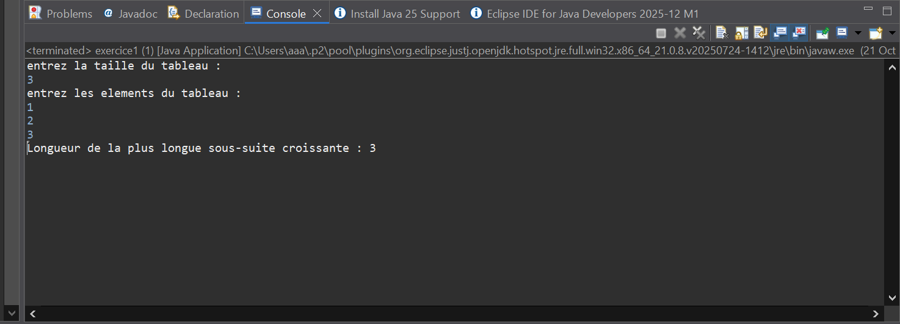
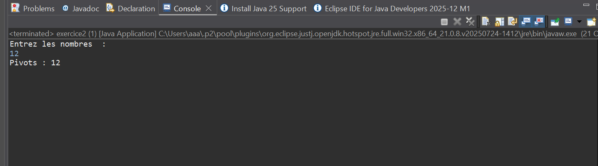
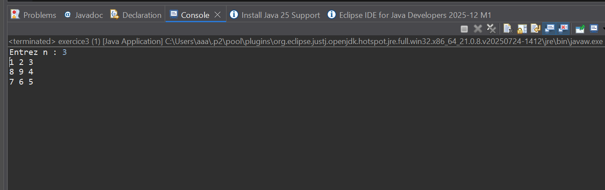
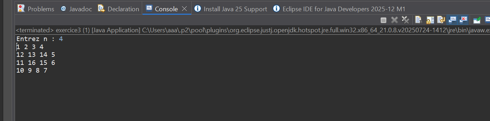
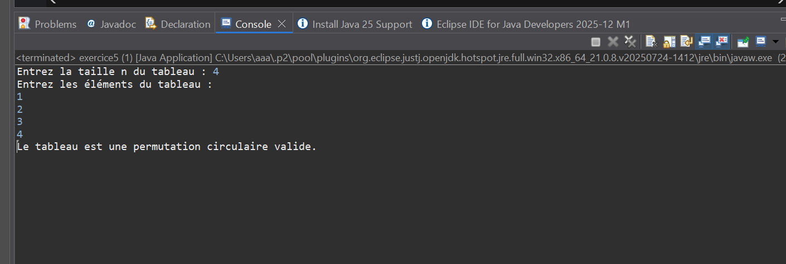
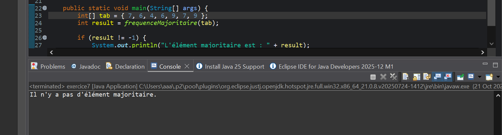
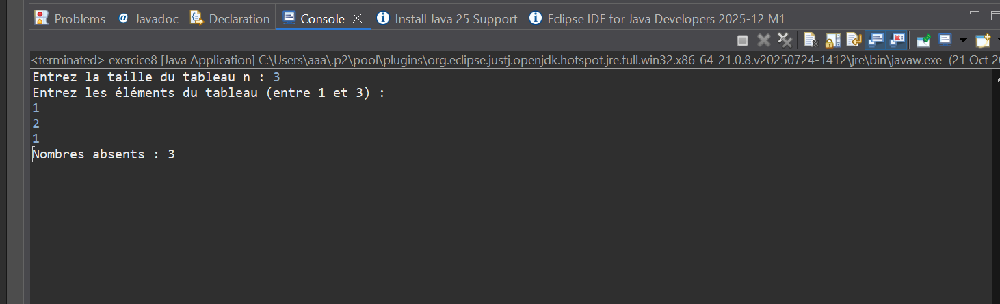
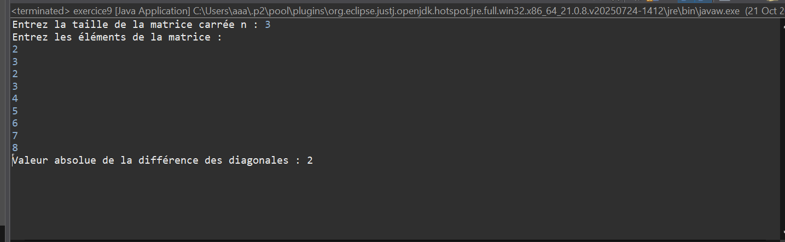
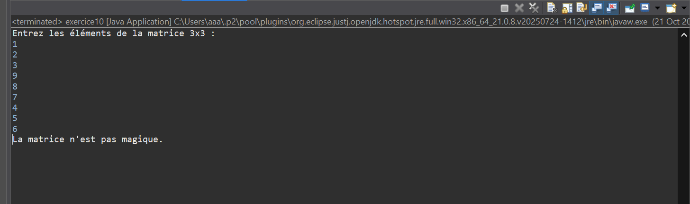

les capture d'ecrants du tp2 du java 
# 🧠 TP2 - Programmation java

Ce projet contient les exercices du TP2 en java.

## 📸 Captures d’écran

Voici les résultats d’exécution :












---

## ⚙️ Compilation
```bash
g++ main.cpp -o main
./main
